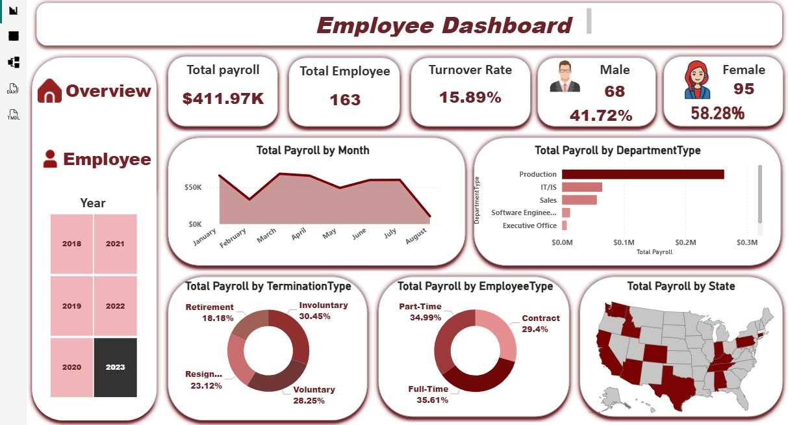
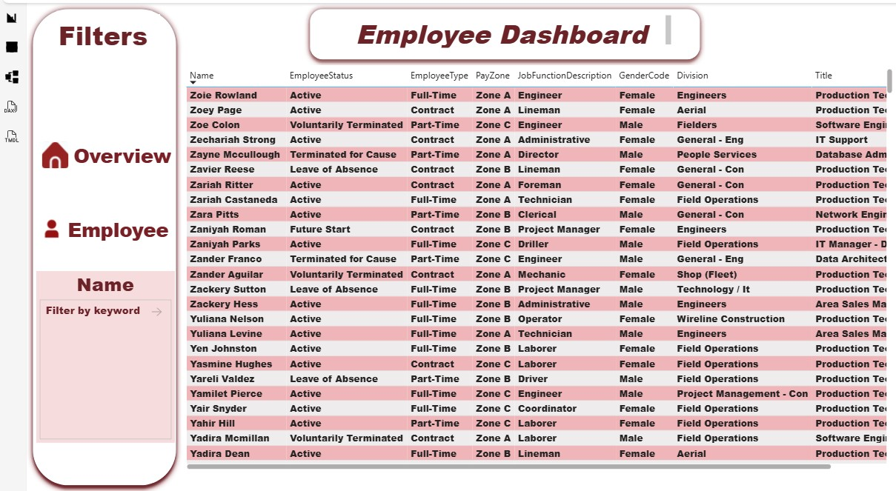
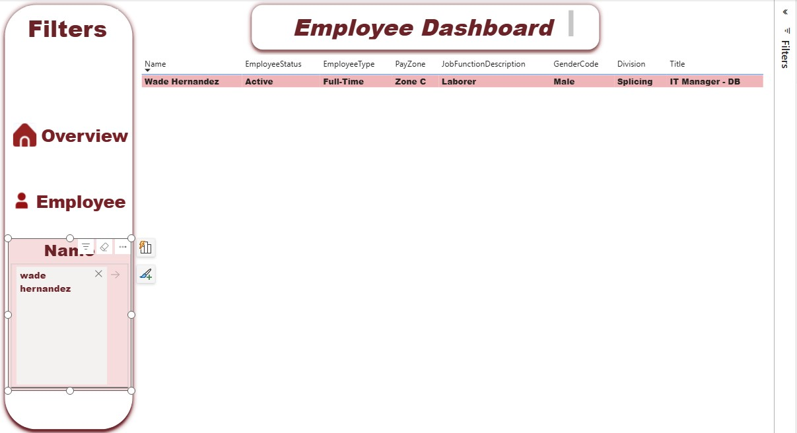

# Employee Performance & Payroll Insights Dashboard

## 📊 Project Overview
This **Power BI Dashboard** provides a comprehensive analysis of workforce demographics, payroll distribution, and employee retention.

## 🖼️ Dashboard Preview

## 🚀 Key Features
* **Workforce Demographics:** Detailed breakdown of gender distribution.
* **KPI Tracking:** Monitoring **Total Payroll ($411.97K)**, **Total Employees (163)**, and **Turnover Rate (15.89%)**.
* **Payroll Analysis:** Geographical distribution of salaries across states.
* **Interactive Navigation:** Professional sidebar for seamless switching between pages.

## 🛠️ Tech Stack
* **Power BI:** Visualization & UI/UX design.
* **DAX:** Custom measures for Turnover Rate & Active Employees logic.
* **Power Query:** Data cleaning and transformation.

---
*Screenshots Reference:*

